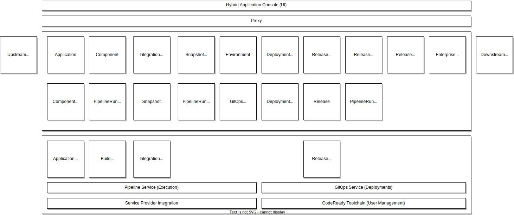

# AppStudio

## Overview
AppStudio is a platform for building integrated experiences that streamline, consolidate, and secure the application lifecycle.

### Goals
- Compose cloud native applications that consist of multiple components and services
- Provide managed application lifecycle
- Rapid bootstrapping of applications
- Fast onboarding of applications to the cloud
- Supports both existing and new applications
- Provide APIs to manage your application lifecycle
- Provide a surface for partners to integrate into the application lifecycle

## Architecture Goals and Constraints
- Robust delivery automation: Establish continuous delivery practices but also deliver operational tooling.
- Just in time scaling: In contrast to “just in case” scaling. The system should be able to scale without capacity reserved ahead of time.
- Static stability: the overall system continues to work when a dependency is impaired
- Each subservice can fulfill its primary use cases independently, without relying on  other systems’ availability.
- Each sub-service owns its data and logic.
- Communication among services and participants is always asynchronous.
- Each sub-service is owned by one team. Ownership does not mean that only one team can change the code, but the owning team has the final decision.
- Minimize shared infrastructure among sub-services
- Participants: onboarding new participants, the flexibility to satisfy the technology preferences of a heterogeneous set of participants. Think of this as the ability to easily create an ecosystem and the ability to support that ecosystem’s heterogeneous needs.
- Security, Privacy, and Governance: Sensitive data is protected by fine-grained access control

## Application Context

The diagram below shows the services that make up AppStudio and their API resources.

API resources in the first row (Application, Component) should primarilly be thought of as
control-plane resources. Users supply these resources to indicate to the system what they want it to
do.

API resources in the second row (PipelineRun, Snapshot) should primarilly be thought of as
data-plane resources. The system responds to user requests by creating and managing the lifecycle of
these resources.

## Service (Component) Context

Each service that makes up AppStudio is further explained in its own document.

- [Hybrid Application Service](./hybrid-application-service.md) - A workflow system that manages
  the definition of the users' Application and Components.
- [Build Service](./build-service.md) - A workflow system that manages the build pipeline definition
  for users' Components.
- [Image Controller](./image-controller.md) - A subsystem of the build-service that manages the
  creation and access rights to container image repositories.
- [Java Rebuilds Service](./jvm-build-service.md) - A subsystem of the build-service that manages
  the rebuild of binary java jars pulled from maven central for an improved degree of provenance.
- [Integration Service](./integration-service.md) - A workflow service that manages execution of
  users' tests and promotion in response to completing builds.
- [Release Service](./release-service.md) - A workflow service that manages execution of privileged
  pipelines to release user content to protected destinations.
- [GitOps Service](./gitops-service.md) - A foundational service providing deployment of user
  applications.
- [Pipeline Service](./pipeline-service.md) - A foundational service providing Pipeline APIs and secure supply
  chain capabilities to other services
- [Service Provider Integration](./service-provider-integration.md) - A foundational service
  providing user secret management to other services.
- [Enterprise Contract](./enterprise-contract.md) - A specialized subsystem responsible for the
  definition and enforcement of policies related to how container images are built and tested.

## API References

### Developer Services

- [Application and Environment API](../ref/application-environment-api.md)
- [Service Provider](../ref/service-provider.md)
- [GitOps Service](../ref/gitops.md):

### Naming Conventions

- [Namespace Metadata](../ADR/adr-0010-namespace-metadata)
