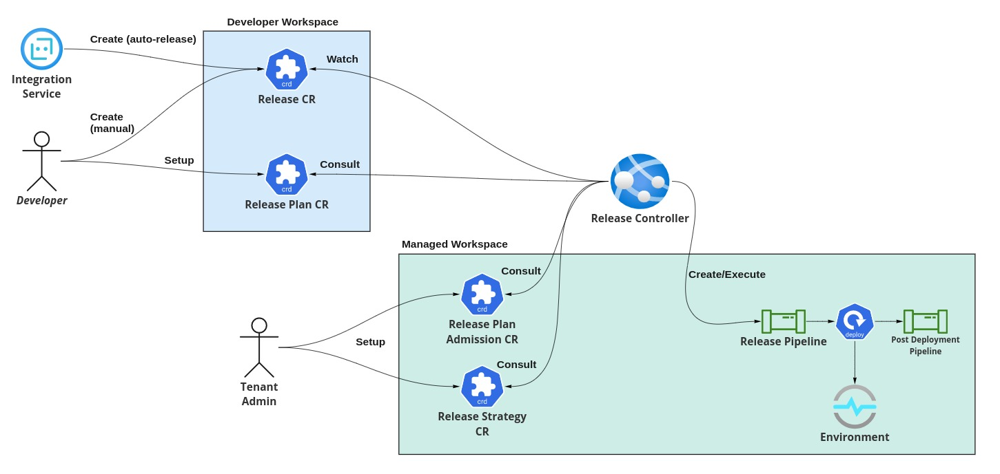

# Release Service

## Overview

The **Release service** is composed of a Release Operator that can create and orchestrate release pipelines defined
in Release Strategies to deliver content.

The main API that is exposed is called the **Release** custom resource. This custom resource is used by the Release
Service as input to request a release of content for an **Application**.

Additional custom resources are used to compose the system. **ReleasePlan** and **ReleasePlanAdmission** define the
relationship between **Development** Workspaces and **Managed** Workspaces.

**Release Strategies** are referenced in **ReleasePlanAdmissions** and are used to define which pipeline should be
executed to deliver content.

In addition, the Release service ensures that no violations in the [Enterprise Contract] exist prior to releasing content.

## Dependencies

The Release service is dependent on the following services:

* [Pipeline Service]
  * Pipeline execution, Pipeline logging
* [Integration Service]
  * Input to Release Service for auto-releasing content
* [Enterprise Contract] Service
  * Provides facilities to validate whether content has passed the Enterprise Contract.

## System Context

The diagram below shows the interaction of the release service and other services.

## Application Context

The diagram below shows the flow of custom resources and the orchestration of pipelines by the release service.

## References

[Enterprise Contract]: ./enterprise-contract.md
[Integration Service]: ./integration-service.md
[Pipeline Service]: ./pipeline-service.md
